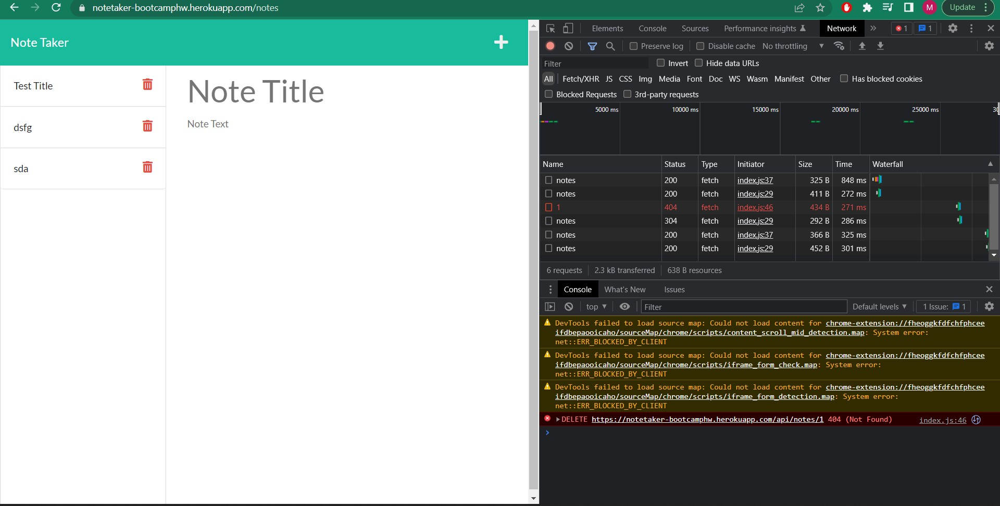

# Note-Taker
A note taker application can be quite useful for users across different professions, as many people at there jobs take notes. Unlike a sticky note this cant be misplaced. In order to build this application, Javascript was used along with Node.js & Express.js.

Improvements
Getting the delete function on the note taker to work. 
<a href='https://notetaker-bootcamphw.herokuapp.com/'>Link</a>
